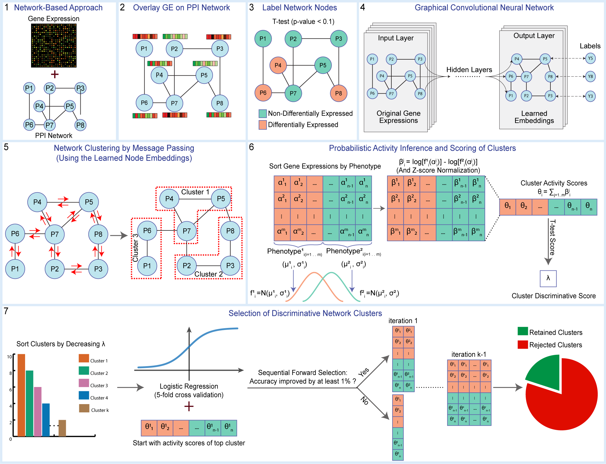

# Graph Convolutional Network for Network Clustering and Disease Classification

Official implementation of graph convolutional network for clustering and Classification.

Omar Maddouri, Xiaoning Qian, and Byung-Jun Yoon, [Deep representations embed network information for robust disease marker identification]

**NOTE: The *scripts* folder is intended to reproduce the experiments from the paper**

## Installation

```python setup.py install```

## Dependencies

```pip install -r requirements.txt ```

## GCNCC workflow



## Usage

```
python train.py
python rank_clusters.py
python init.py
```
**For more details, please see the *scripts/* folder**

## Cite

Please cite our paper if you use this code in your own work.

```

```
