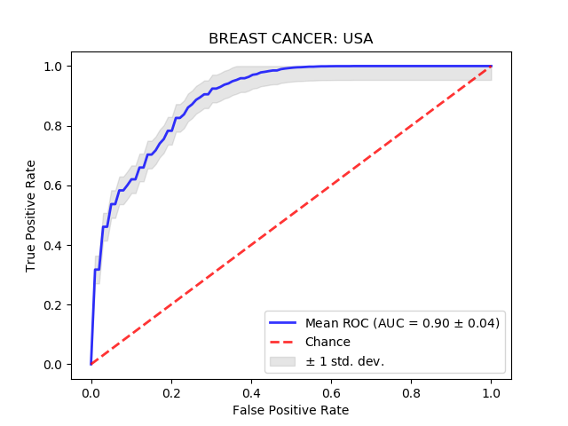

# Usage

To reproduce the the results of our paper you need to follow the below steps:
1) Download the GitHub repository locally.
2) Download the PPI network "9606.protein.links.v10.5.txt" or newer for homo sapiens from STRING (https://string-db.org/cgi/download.pl).
3) Copy the downloaded PPI network file under the folders (BRC_microarray/input/, SCZ_RNAseq/input/, SCZ_microarray/input/).
4) Under the script files of each dataset folder run:  
``` python prepare_files.py```  
(Example: the folder ***scripts/BRC_microarray/USA/*** contains the script files for the breast cancer USA dataset).
5) If you want to retrain the clusters and then get the results, run:
```
python train.py
python rank_clusters.py #Run as well all files with prefix rank_clusters_
python init.py  #Run as well all files with prefix init_
```
Otherwise, you can simply use the pretrained clusters and directly generate the paper results by running:
```
python init.py  #Run as well all files with prefix init_
```
Example: Prediction accuracy on the USA breast cancer dataset:


**Note: For each analysed dataset, the *output/* folder contains the set of generated files including the resulting clusters and the selected markers**

# Output files (some examples)
1) ***PPI.ids.txt***: Contains the mapping ids of the node instances.  
Example:
```
ENSP00000000233	0
ENSP00000000412	1
ENSP00000000442	2
ENSP00000001008	3
ENSP00000001146	4
...
```
2) ***PPI.clusters.txt***: contains the resulting clusters by gene id (each line corresponds to one cluster).  
Example:
```
Center_10579	2089	10579	11409	14054	14740	17224
Center_13991	2090	4513	11641	13991	14910	18794
Center_15399	2100	2232	4461	5808	7364	13389	15001	15399
```
3) ***PPI.enrichment.txt***: contains the resulting clusters by gene name.  
Example:
```
PKDREJ	ESR2	NAT9	PAX7	AGRN	NTF3
NUTM2F	OR5M9	OR51A7	OR8B2	ENSP00000369622	MCF2L
ACSS2	ALDH3B2	FADS3	CRYL1	CPT1B	CHRDL1	AKR1C2	RNF180
```
4) ***PPI.final_features.txt***: contains the line indices in the ***PPI.clusters.txt*** file of the selected markers on the given dataset.  
Example:
```
75	80	0	126	108	148	400
```
5) ***PPI.adjacency.matrix***: contains the adjacency matrix of the PPI network in edge list format.
6) ***PPI.GE_Features.txt***: contains the gene expression levels (features) labeld by network node ids.
7) ***PPI.embeddings.txt***: contains the resulting node embeddings learned by the GCN architecture.
